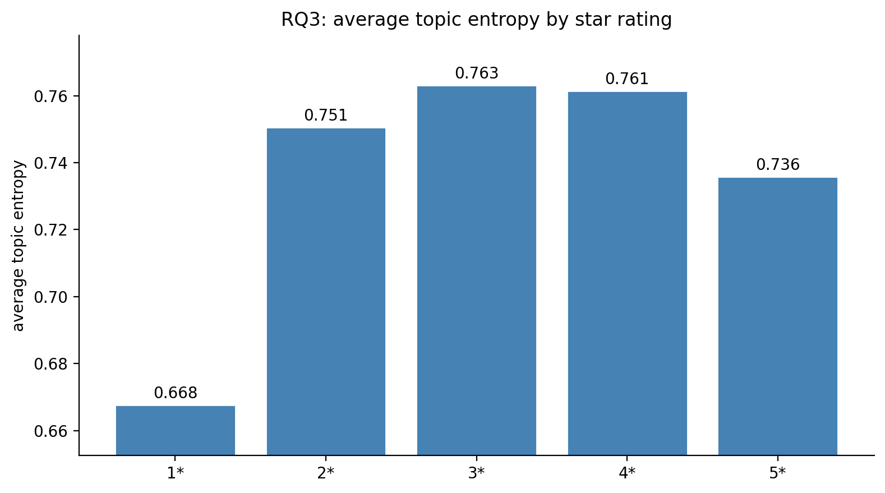

# Yelp Review Star Rating Classification

CSCE 676 final project. Lipai Huang (UIN 630003919).

👉 Start here: [main_notebook.ipynb](main_notebook.ipynb)

📹 Project video: https://www.youtube.com/watch?v=OSRRQMF03w8

## Overview

A TF-IDF + Logistic Regression baseline on the Yelp Review Full dataset reaches around 53% accuracy on a 5-class star rating task, but the per-class F1 is uneven. Extreme ratings (1 and 5) are easy, middle ratings (2, 3, 4) are noticeably harder. This notebook studies why, working through three research questions about review length, text representation, and topic structure.

## Research Questions

1. Does review length affect the per-class gap?
2. Does the choice of text representation (CountVectorizer vs TF-IDF) change the gap?
3. Are middle reviews more topically mixed than extreme ones?

## Data

Dataset: Yelp Review Full from Hugging Face ([`Yelp/yelp_review_full`](https://huggingface.co/datasets/Yelp/yelp_review_full)). 650K training reviews and 50K test reviews, 5-class star labels, balanced across all five classes. The dataset is loaded at runtime via the `datasets` library, so no manual download is needed. Preprocessing is minimal: lowercase and whitespace normalization, applied identically to train and test.

## How to Reproduce

This notebook was built locally with Python 3.11 in an Anaconda environment, not in Colab.

```
pip install -r requirements.txt
```

Open `main_notebook.ipynb` and run all cells in order. The first cells download the Yelp dataset from Hugging Face (about 600 MB) and cache it locally for later runs. Total runtime is a few minutes on CPU.

## Key Dependencies

- Python 3.11
- pandas 3.0
- numpy 1.26
- scikit-learn 1.8
- scipy 1.14
- matplotlib 3.10
- datasets 4.5

The full snapshot is in `requirements.txt`.

## Repo Structure

```
.
├── main_notebook.ipynb              <- final deliverable
├── readme.md
├── requirements.txt
├── checkpoints/
│   ├── 630003919_checkpoint1.ipynb
│   └── 630003919_checkpoint2.ipynb
├── assets/
│   ├── rq1_length_heatmap.png
│   ├── rq2_confusion.png
│   └── rq3_entropy.png
└── .gitignore
```

## Results Summary

The baseline reaches 0.527 accuracy and 0.523 macro F1. Per-class F1 is highly uneven: the extreme classes (1 and 5) average around 0.65, while the middle classes (2, 3, 4) average around 0.44.

Three research questions address this gap from different angles. Length and representation each affect the gap modestly but do not close it. Topic modeling provides the cleanest explanation. Middle reviews have measurably higher topic entropy in a 5-topic LDA fit, meaning they genuinely span multiple topics, and a single star label cannot capture that blend.


